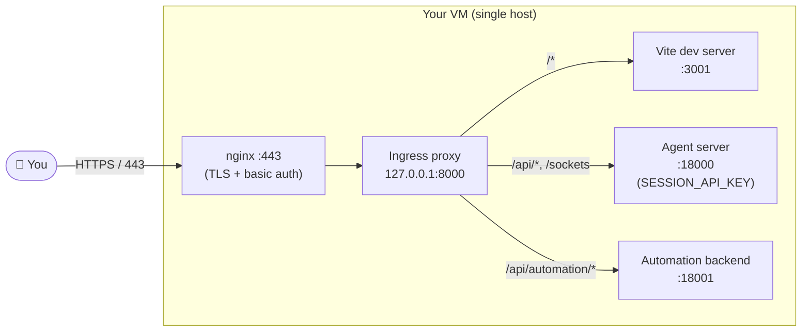

# Self-Hosting Agent Canvas on a Virtual Machine

This guide walks through running Agent Canvas on a virtual machine (VM) so you
(and only you) can reach it from anywhere via a browser.

> [!CAUTION]
> Agent Canvas drives an agent that can read and write the filesystem of the
> machine it runs on, execute shell commands, and reach the network. Anyone who
> can talk to the agent server can do the same. **Treat the VM as you would any
> machine that holds production credentials**, and lock it down before exposing
> it to the public internet. The defenses below are layered on purpose — do not
> skip any of them.

## Quickstart
1. **Provision a machine**: this could be a VM on AWS or DigitalOcean, or hardware like a dedicated Mac Mini
2. **Secure the machine**: make sure it's not exposed to the public internet
3. **Run the server**: clone this repo and run `npm run dev:dangerously-dockerless`
4. **Get a domain**: (Optional) point a domain at your machine and set up nginx+letsencrypt
5. **Connect locally**: (Optional) point your local Agent Canvas to the VM by adding a backend

## Details

The deployment model:



`npm run dev:dangerously-dockerless` spins up the Vite dev server, the agent
server, and the automation backend, and fronts them with an ingress proxy on
`127.0.0.1:8000` that routes by path. nginx only needs to know about that
single ingress port — it doesn't talk to the three upstreams directly.

The defenses layered on top of this:

1. **Cloud / network firewall (step 2)** — by default nothing inbound is
   reachable except SSH from your IP. If you do step 4, you additionally open
   80 and 443 (ideally still restricted to your IP allow-list on 443).
2. **`SESSION_API_KEY` on the agent server (step 3, auto-generated)** —
   every `/api/*` call must carry a matching `X-Session-API-Key` header.
   This guards against any misconfiguration that lets a request bypass the
   firewall (e.g. a stray bind to `0.0.0.0`).
3. **nginx HTTP basic auth (step 4, optional)** — if you expose the UI on a
   public domain, every request must additionally present a username and
   password before it ever reaches the application.

## 1. Provision a machine

Any always-on Linux (or macOS) host with a stable network connection will do.
Pick whichever fits your situation:

- **A cloud VM** from any provider — DigitalOcean, AWS EC2, GCP Compute Engine,
  Hetzner, Linode, etc. Ubuntu 24.04 LTS is a good default. 2 vCPU / 4 GB RAM
  is plenty for a single user; bump it up if you plan to keep many
  long-running conversations.
- **Dedicated hardware on your network** — a Mac Mini, an Intel NUC, a spare
  laptop. The same setup applies; just keep in mind that anything reachable
  from your LAN is also part of the threat model.

Whichever you pick, treat the machine as the single source of truth for the
agent — it will hold your conversation history, secrets, and any credentials
the agent needs.

## 2. Secure the machine

> [!IMPORTANT]
> Do this **before** you start the agent server for the first time. The whole
> point is that nothing on the public internet should be able to reach the
> agent until you have explicitly chosen how to expose it.

The default posture should be: **nothing inbound is reachable from the public
internet** except SSH (and only from your own IP). The agent server, the
automation backend, the Vite dev server, and the ingress proxy will all bind
to `127.0.0.1` on their own (see step 3), but the network firewall is what
guarantees no one else can reach them even if something binds wrong.

Restrict inbound traffic at the cloud-provider / network level (DigitalOcean
Cloud Firewall, AWS Security Group, GCP firewall rule, Hetzner firewall, your
home router's port-forwarding rules, etc.):

- **Inbound 22 (SSH)** — restrict to your own IP / VPN CIDR. Never leave it
  open to `0.0.0.0/0` long-term.
- **Everything else** — drop. In particular, the ingress port (`:8000`), the
  agent server (`:18000`), the automation backend (`:18001`), and the Vite
  dev server (`:3001`) must not be reachable from outside the host.

If you are running inside Kubernetes, use a `NetworkPolicy` to the same effect:
deny all ingress by default and only allow what you explicitly need.

At this point your machine is reachable only over SSH. That's enough to run
the agent (step 3) and access the UI through an SSH tunnel. If you also want
to reach it from a browser without tunneling, you'll open ports 80 and 443
in the optional domain + nginx step (step 4).

For an extra host-level backstop, see
[Advanced: defense in depth](#advanced-defense-in-depth) at the end of this
document.

## 3. Run the server

Install the prerequisites on the machine. On Ubuntu:

```bash
apt-get update
apt-get install -y curl git
# Node.js 22.x (use nvm, asdf, or NodeSource — whatever you prefer)
# uv (for the agent-server uvx runtime):
curl -LsSf https://astral.sh/uv/install.sh | sh
```

On macOS (Mac Mini, etc.) install Node and `uv` via `brew` instead.

Clone this repo, install dependencies, and start the server:

```bash
git clone https://github.com/OpenHands/agent-canvas.git
cd agent-canvas
npm install
npm run dev:dangerously-dockerless
```

> [!WARNING]
> `dev:dangerously-dockerless` runs the agent server **directly on the host**.
> The agent has full access to the machine's filesystem, environment, and
> network. That is exactly why the firewall (step 2) and the
> `SESSION_API_KEY` below are non-negotiable: they are what stop a stranger
> from walking in and getting that same access.

The ingress proxy binds to `127.0.0.1:8000`, and the underlying agent server,
automation backend, and Vite dev server all bind to `127.0.0.1` as well — so
they're only reachable from the machine itself.

## 4. (Optional) Get a domain and put nginx + Let's Encrypt + basic auth in front

If you want to reach the UI from a browser without an SSH tunnel — for
example, to use it from a phone or a machine you can't easily forward ports
from — point a domain at the host and front it with nginx + TLS + HTTP basic
auth. nginx terminates TLS, requires basic auth, and forwards to the ingress
on `127.0.0.1:8000`.

### Point a domain at the machine

Register a domain (or use one you already own) and create an `A` record
pointing to the machine's public IPv4 — for example `canvas.example.com`.
Verify DNS has propagated:

```bash
dig +short canvas.example.com
```

### Open ports 80 and 443

Go back to your network firewall and additionally allow inbound:

- **Inbound 80 (HTTP)** — open to `0.0.0.0/0`. Let's Encrypt's HTTP-01
  challenge verifies from many IPs worldwide, so this must be world-open
  during issuance and renewal. nginx will redirect it to HTTPS.
- **Inbound 443 (HTTPS)** — this is what you'll actually use. Restrict to
  your own IP / VPN CIDR if you can. If you need it world-open (e.g. you
  roam often), basic auth + `SESSION_API_KEY` become your primary defense.

### Install nginx, certbot, and helpers

```bash
apt-get install -y nginx certbot python3-certbot-nginx apache2-utils acl
```

### Create a basic-auth user

```bash
mkdir -p /root/.openhands
htpasswd -c /root/.openhands/.htpasswd <username>   # first user only; -c overwrites
# Add more users without -c:
# htpasswd /root/.openhands/.htpasswd <another-user>
```

If you keep the password file under `/root` (mode `0700`), nginx workers run
as `www-data` and cannot traverse into it. Grant just enough access with
POSIX ACLs instead of loosening `/root`:

```bash
setfacl -m u:www-data:--x /root
setfacl -m u:www-data:r-- /root/.openhands/.htpasswd
sudo -u www-data cat /root/.openhands/.htpasswd >/dev/null && echo OK
```

Re-apply these ACLs whenever the htpasswd file is recreated.

### nginx site config

Drop this at `/etc/nginx/sites-available/canvas.example.com`, replacing
`canvas.example.com` with your domain. Agent Canvas's default ingress port is
`8000`.

```nginx
server {
    listen 80;
    listen [::]:80;
    server_name canvas.example.com;

    # Allow ACME HTTP-01 challenges through without auth.
    location /.well-known/acme-challenge/ {
        auth_basic off;
        root /var/www/html;
    }

    location / {
        auth_basic "Restricted";
        auth_basic_user_file /root/.openhands/.htpasswd;

        proxy_pass http://127.0.0.1:8000;
        proxy_http_version 1.1;
        proxy_set_header Host $host;
        proxy_set_header X-Real-IP $remote_addr;
        proxy_set_header X-Forwarded-For $proxy_add_x_forwarded_for;
        proxy_set_header X-Forwarded-Proto $scheme;

        # WebSocket / SSE support — required for live agent events.
        proxy_set_header Upgrade $http_upgrade;
        proxy_set_header Connection "upgrade";
        proxy_read_timeout 3600s;
        proxy_send_timeout 3600s;
    }
}
```

Enable and reload:

```bash
ln -sf /etc/nginx/sites-available/canvas.example.com \
       /etc/nginx/sites-enabled/canvas.example.com
nginx -t && systemctl reload nginx
```

### Issue a certificate

```bash
certbot --nginx -d canvas.example.com \
    --non-interactive --agree-tos \
    --email you@example.com \
    --redirect
```

`certbot` rewrites the file to add a `listen 443 ssl` block and a 301 from
HTTP to HTTPS. The basic-auth `location /` and the
`/.well-known/acme-challenge/` exception are preserved.

`certbot` installs a systemd timer (`certbot.timer`) that auto-renews twice a
day; nginx is reloaded automatically on success.

### Verify

```bash
curl -I https://canvas.example.com/                       # → 401 Unauthorized
curl -I -u <user>:<pass> https://canvas.example.com/      # → 200
curl -I http://canvas.example.com/                        # → 301 to https
```

If you see `502 Bad Gateway`, the app on `127.0.0.1:8000` is down — check
`journalctl -u agent-canvas -f`.

### Smoke-test from your laptop

Open `https://canvas.example.com/`, enter your basic-auth credentials, and
confirm that you land in Agent Canvas. Conversations, settings, and the LLM
provider picker all hit `/api/*` routes that are guarded by both basic auth
(at nginx) and `X-Session-API-Key` (at the agent server). If the API calls
return `401`, the persisted session key and the one baked into the frontend
have drifted apart — delete `~/.openhands/agent-canvas/session-api-key.txt`
and restart the app so both sides regenerate from the same value.

## 5. (Optional) Connect your local Agent Canvas to the remote machine

If you already run Agent Canvas locally (e.g. via `npm run dev` on your
laptop), you can register the remote machine as an additional backend and
flip between local and remote from the UI — no need to keep a browser tab
open against the remote domain.

1. On the remote machine, read the auto-generated session key:

   ```bash
   cat ~/.openhands/agent-canvas/session-api-key.txt
   ```

2. In your local Agent Canvas, open **Manage backends** and click
   **Add a backend**. Fill in:
   - **Host Name** — anything memorable, e.g. `my-vm`.
   - **Host** — the URL you exposed in step 4, e.g. `https://canvas.example.com`.
     If you skipped step 4 and are using an SSH tunnel, use the forwarded
     local URL (e.g. `http://localhost:8000`) while the tunnel is open.
   - **Session API key** — the value from `session-api-key.txt`.
3. Save. The new backend should show up as "Connected" with the remote
   server's version. Pick it from the backend switcher in the menu and the
   UI will start talking to the remote machine.

> [!NOTE]
> If you put nginx basic auth in front of the remote (step 4), the browser
> needs the basic-auth credentials too. The easiest way is to visit
> `https://canvas.example.com/` in the same browser first and authenticate
> — the browser will cache the credentials and reuse them for the
> cross-origin `/api/*` calls made by your local Agent Canvas. Alternatively,
> skip basic auth and rely on the cloud firewall + `SESSION_API_KEY` for
> protection.
