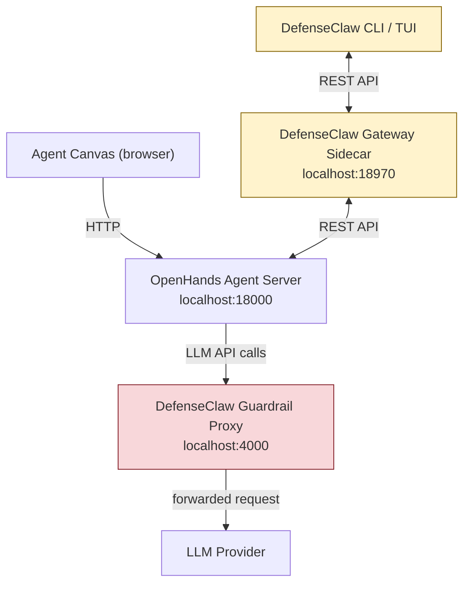

# Integrating DefenseClaw with Agent Canvas

[DefenseClaw](https://github.com/cisco-ai-defense/defenseclaw) is a security governance layer for agentic AI runtimes — it scans skills and MCP servers before they run, inspects LLM traffic at runtime, and produces durable audit evidence. This guide explains how to run DefenseClaw alongside the [OpenHands Agent Server](https://github.com/OpenHands/software-agent-sdk/tree/main/openhands-agent-server) that powers Agent Canvas, without making any code-level changes to either project.

> **Status:** DefenseClaw is purpose-built around the OpenClaw runtime and its TypeScript plugin hooks. The integration described here targets the lowest-friction overlap points — skill injection, LLM proxying, CLI scanning, and audit export — that work without modifying Agent Canvas or DefenseClaw source code. [Future work](#future-work-code-level-extensions) describes deeper hooks that would require code changes.

---

## How the Two Systems Fit Together



**Shared concepts:**

| Agent Canvas / Agent Server | DefenseClaw equivalent |
|---|---|
| Skills (`.agents/skills/`) | Skills (scanned by `cisco-ai-skill-scanner` + CodeGuard) |
| MCP servers | MCP servers (scanned by `cisco-ai-mcp-scanner`) |
| LLM settings (`base_url`) | Guardrail proxy upstream target |
| Workspace files (generated code) | CodeGuard scan surface |
| Agent Server hooks | Potential enforcement point (future work) |

---

## Prerequisites

| Component | Version |
|---|---|
| Agent Canvas / Agent Server | Current `main` |
| Python | 3.10+ |
| Go | 1.26.2+ (for DefenseClaw gateway) |
| DefenseClaw | Latest release |

---

## Installation

### 1. Install and initialise DefenseClaw

```bash
# Install from the release script
curl -LsSf https://raw.githubusercontent.com/cisco-ai-defense/defenseclaw/main/scripts/install.sh | bash

# Initialise config and enable the guardrail proxy
defenseclaw init --enable-guardrail
```

Verify the installation:

```bash
defenseclaw doctor
```

Start the Go gateway sidecar (keep this running alongside the Agent Server):

```bash
defenseclaw-gateway start
```

### 2. Start Agent Canvas

Follow the standard [Agent Canvas quickstart](../README.md). The integration steps below assume the Agent Server is reachable at `http://localhost:18000`.

---

## Integration Points

### A. Load the CodeGuard Skill

DefenseClaw ships a ready-made OpenHands skill — `skills/codeguard/SKILL.md` — that teaches the agent the CodeGuard security rules. When the skill is active, the agent writes code that avoids the patterns DefenseClaw blocks at scan time (hardcoded secrets, `os.system()`, string-interpolated SQL, weak crypto, path traversal, etc.).

**Install the skill into a user or project skill directory:**

```bash
# User-level (applies to all Agent Server conversations on this machine)
mkdir -p ~/.agents/skills/codeguard
curl -fsSL https://raw.githubusercontent.com/cisco-ai-defense/defenseclaw/main/skills/codeguard/SKILL.md \
  -o ~/.agents/skills/codeguard/SKILL.md

# Project-level (checked in alongside your project, only affects that workspace)
mkdir -p .agents/skills/codeguard
curl -fsSL https://raw.githubusercontent.com/cisco-ai-defense/defenseclaw/main/skills/codeguard/SKILL.md \
  -o .agents/skills/codeguard/SKILL.md
```

The Agent Server loads skills from these directories automatically at conversation start. No restart of the server is required for user-level skills; project-level skills are loaded when the conversation workspace is opened.

**What this achieves:** The agent's system prompt is augmented with the full CodeGuard rule set. Code it generates will pre-emptively avoid the patterns that the downstream `defenseclaw codeguard scan` would flag.

---

### B. Route LLM Traffic Through the Guardrail Proxy

The DefenseClaw guardrail proxy runs on `localhost:4000` and acts as an OpenAI-compatible reverse proxy. Pointing the Agent Server's LLM calls through it causes every prompt and completion to be inspected — in observe mode (log only) or action mode (block on policy violations).

**Configure the LLM base URL in Agent Canvas:**

Open the Agent Canvas settings panel → select your active backend → under **LLM settings**, set **Base URL** to:

```
http://localhost:4000
```

Leave the model name and API key as-is. The proxy reads the original `Authorization` / `x-api-key` header, forwards the request to the real provider, and injects its own `X-DC-Target-URL` routing header — the agent code and Agent Server require no changes.

**Via environment variable (server-side):**

If you configure your Agent Server through environment variables, set the LLM base URL before starting it:

```bash
# Example using OpenAI; set model and key as normal, only base_url changes
export OH_LLM__BASE_URL="http://localhost:4000"
npm run dev
```

> Consult the Agent Server [settings schema](https://github.com/OpenHands/software-agent-sdk/blob/main/openhands-agent-server/openhands/agent_server/settings_router.py) for the exact environment variable name used in your deployment.

**Start the guardrail in observe mode (safe default) or action mode:**

```bash
# Observe — log findings, never block (recommended while tuning)
defenseclaw setup guardrail --mode observe --restart

# Action — block prompts and responses that match policies
defenseclaw setup guardrail --mode action --restart
```

**Supported providers:**

The DefenseClaw proxy handles Anthropic (`api.anthropic.com`), OpenAI (`api.openai.com`), OpenRouter, Azure OpenAI, Gemini, Ollama, and Bedrock. Provider detection is automatic based on the target URL.

---

### C. Scan Skills Before Loading

Before installing a skill from the marketplace or an external source into the Agent Server, use the DefenseClaw CLI to vet it:

```bash
# Scan a locally downloaded skill directory
defenseclaw skill scan path/to/skill-directory

# Scan an installed skill by name (requires the skill to be registered in the DefenseClaw inventory)
defenseclaw skill scan my-skill-name

# List all skills currently visible to DefenseClaw
defenseclaw skill list
```

The scanner applies `cisco-ai-skill-scanner` rules plus CodeGuard static analysis and emits a verdict (`PASS`, `WARN`, `BLOCK`) with per-finding details. HIGH and CRITICAL findings block skill use in action mode.

**Workflow recommendation:** Add `defenseclaw skill scan <skill-dir>` as a pre-commit or CI step in repositories that ship skills for Agent Canvas.

---

### D. Scan Agent-Generated Code

After an agent conversation produces code in the workspace, run CodeGuard on the output before committing:

```bash
# Scan an entire workspace directory
defenseclaw codeguard scan /path/to/workspace

# Scan a single file
defenseclaw codeguard scan /path/to/workspace/src/auth.py

# Output as JSON (useful in CI pipelines)
defenseclaw codeguard scan /path/to/workspace --json
```

CodeGuard checks for hardcoded secrets, dangerous command execution, SQL injection, unsafe deserialization, weak cryptography, SSRF-prone network calls, and path traversal — covering Python, JavaScript, TypeScript, Go, Java, Ruby, and PHP.

**Zero-friction CI gate example (GitHub Actions):**

```yaml
- name: Scan agent-generated code
  run: |
    defenseclaw codeguard scan ${{ github.workspace }} --json \
      | python3 -c "
    import sys, json
    findings = json.load(sys.stdin)
    criticals = [f for f in findings if f.get('severity') in ('HIGH','CRITICAL')]
    if criticals:
        for f in criticals:
            print(f'::error file={f[\"file\"]},line={f[\"line\"]}::{f[\"rule\"]}: {f[\"message\"]}')
        sys.exit(1)
    "
```

---

### E. Monitor via the DefenseClaw TUI and Audit Store

All scan results, guardrail decisions, tool-call inspections, and policy verdicts are written to DefenseClaw's SQLite audit store. The TUI gives a live operator view:

```bash
defenseclaw tui
```

The TUI panels cover:
- **Alerts** — recent HIGH/CRITICAL findings and blocked events
- **Scans** — historical scan results per skill/file
- **Tools** — tool-call verdicts from the inspection engine
- **Policy** — current block/allow lists

**Export to external systems:**

| Target | Setup |
|---|---|
| OTLP (Prometheus/Grafana/Honeycomb) | `defenseclaw setup observability --otlp-endpoint http://collector:4317` |
| Splunk HEC | `defenseclaw setup splunk --hec-url http://splunk:8088 --hec-token $TOKEN` |
| Slack / PagerDuty / Webex | `defenseclaw setup notifications --slack-webhook $SLACK_URL` |
| Local Splunk bundle (Docker) | `defenseclaw setup splunk --logs --accept-splunk-license` |

---

## Integration Summary

| Goal | Mechanism | Config change? | Code change? |
|---|---|---|---|
| Agent writes secure code by default | CodeGuard skill in `.agents/skills/` | Drop-in file | No |
| Inspect all LLM prompts and responses | Guardrail proxy at `localhost:4000` | Set `base_url` | No |
| Vet skills before loading | `defenseclaw skill scan` in CI/workflow | None | No |
| Scan agent-generated code | `defenseclaw codeguard scan <workspace>` | None | No |
| Audit trail and alerting | DefenseClaw TUI, OTLP, Splunk, webhooks | DefenseClaw config | No |

---

## Future Work: Code-Level Extensions

The following integrations would require changes to Agent Canvas, the Agent Server, or DefenseClaw, but would significantly deepen the security posture.

### 1. Native `SecurityAnalyzer` hook

The OpenHands SDK exposes a [`SecurityAnalyzer`](https://docs.openhands.dev/sdk/arch/security.md) interface. A custom implementation could call DefenseClaw's `/api/v1/inspect/tool` endpoint before every tool invocation — mirroring the inspection the OpenClaw TypeScript plugin performs. This would gate bash commands, file writes, and other tool calls through DefenseClaw's four-stage inspection pipeline (regex, Cisco AI Defense cloud rules, LLM judge, OPA policy) before they execute.

```python
# Sketch — not yet implemented
class DefenseClawSecurityAnalyzer(SecurityAnalyzer):
    async def analyze(self, action: Action) -> ActionSecurityRisk:
        resp = await httpx.post(
            "http://localhost:18970/api/v1/inspect/tool",
            json={"tool": action.tool_name, "args": action.args},
            headers={"X-DefenseClaw-Client": "agent-server"},
        )
        if resp.json()["action"] == "block":
            return ActionSecurityRisk.HIGH
        return ActionSecurityRisk.LOW
```

### 2. Skill install pipeline integration

The Agent Server's `skills_service.py` (`service_install_skill`) runs skill validation during install. A pre-install hook that calls `defenseclaw skill scan` and fails the install on HIGH/CRITICAL findings would enforce a mandatory scan gate — no skill reaches the agent without passing DefenseClaw's scanner. This change would live in `openhands-agent-server`.

### 3. Hooks integration

The Agent Server loads `.openhands/hooks.json` from the workspace. An `on_conversation_end` hook that runs `defenseclaw codeguard scan <workspace>` and writes findings to a structured report file would give per-session security evidence without manual operator intervention.

### 4. Agent Canvas security dashboard

A dedicated panel in the Agent Canvas UI that queries DefenseClaw's gateway REST API (`GET /alerts`, `GET /enforce/blocked`) would surface guardrail findings inline with the conversation view — correlating blocked prompts or tool calls with the agent turn that triggered them.

### 5. Agent Server → DefenseClaw audit bridge

The Agent Server supports outgoing webhooks (`WebhookSpec`). A webhook handler that forwards conversation events to `POST /audit/event` on the DefenseClaw gateway would allow DefenseClaw's audit store to record Agent Server conversation lifecycle events (start, tool invocation, finish) alongside its own security findings — building a single correlated audit trail.

### 6. Skill registry alignment

DefenseClaw's registry system (`defenseclaw registry add`) ingests external skill/MCP catalogs from ClawHub, Smithery, skills.sh, HTTP YAML, and Git sources. Aligning the Agent Server's marketplace skill catalog with the DefenseClaw registry would allow `defenseclaw skill scan all` to exhaustively vet the entire available catalog, not just individually installed skills.

---

## References

- [DefenseClaw GitHub](https://github.com/cisco-ai-defense/defenseclaw)
- [DefenseClaw Quick Start](https://github.com/cisco-ai-defense/defenseclaw/blob/main/docs/QUICKSTART.md)
- [DefenseClaw API Reference](https://github.com/cisco-ai-defense/defenseclaw/blob/main/docs/API.md)
- [DefenseClaw Guardrail Architecture](https://github.com/cisco-ai-defense/defenseclaw/blob/main/docs/GUARDRAIL.md)
- [DefenseClaw CodeGuard Skill](https://github.com/cisco-ai-defense/defenseclaw/blob/main/skills/codeguard/SKILL.md)
- [OpenHands Agent Server](https://github.com/OpenHands/software-agent-sdk/tree/main/openhands-agent-server)
- [OpenHands SDK Security Analyzer](https://docs.openhands.dev/sdk/arch/security.md)
- [Agent Canvas Self-Hosting](../SELF_HOSTING.md)

---

_This document was created by an AI agent (OpenHands) on behalf of the user._
