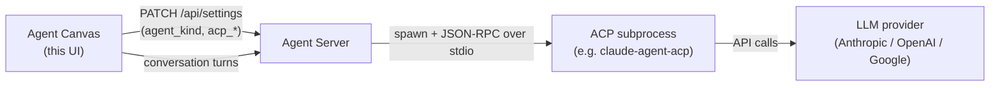

# Using ACP agents

Agent Canvas can drive your conversations with the built-in **OpenHands** agent or
with an external **ACP agent** — Claude Code, Codex, or Gemini CLI. This guide
explains what ACP agents are, how to onboard one, and how to switch agents or
models later.

## What is an ACP agent?

The [Agent Client Protocol (ACP)](https://agentclientprotocol.com/protocol/overview)
is a standard for talking to coding agents over JSON-RPC on stdio. Instead of
Agent Canvas calling an LLM directly, the Agent Server spawns the agent's own CLI
as a subprocess and relays each turn to it. The external agent manages its own
LLM, tools, and execution; Agent Canvas sends messages and renders what comes
back.



The Agent Server owns the subprocess and the credentials; Agent Canvas only
records *which* agent to run and surfaces a form for the secrets it needs. The
agent choice is stored per backend, so switching backends can switch agents.

## Supported providers

The provider list is sourced from the SDK registry
(`openhands.sdk.settings.acp_providers`, mirrored into
`@openhands/typescript-client`) and enriched with Canvas UI metadata in
[`src/constants/acp-providers.ts`](../src/constants/acp-providers.ts). Adding or
changing a provider happens upstream in the SDK, not here.

| Provider | Default command |
|---|---|
| **Claude Code** | `npx -y @agentclientprotocol/claude-agent-acp` |
| **Codex** | `npx -y @agentclientprotocol/codex-acp` |
| **Gemini CLI** | `npx -y @google/gemini-cli --acp` |

See [Authentication](#authentication) for how each one authenticates.

## Authentication

> [!IMPORTANT]
> ACP agents authenticate **two ways: a subscription login, or an API key** — and
> the onboarding fields are optional. If you're already signed in to the
> provider's CLI on the machine the agent runs on, it reuses that login
> automatically, so locally you often don't need a key at all. **The login takes
> priority over an API key:** while you're signed in, a key set in the
> environment isn't used — so the onboarding key fields do nothing and can be
> left blank.

A "subscription login" is the credential the provider's own CLI stores when you
sign in once — a file in your home directory, or, for Claude Code on macOS, the
system **Keychain**. When the Agent Server runs **on that same machine** (a local
or self-hosted backend), the provider CLI finds that login automatically — no API
key required. On a clean cloud sandbox there's no stored login, so an API key is
needed instead.

| Provider | Subscription login (auto-detected) | API key |
|---|---|---|
| **Claude Code** | A Claude Code login (Pro/Max), from Claude Code's own credential store: the **macOS Keychain**, or `~/.claude/.credentials.json` on Linux | `ANTHROPIC_API_KEY` *(onboarding)* |
| **Codex** | A ChatGPT login (`codex login`) cached at `~/.codex/auth.json` | `OPENAI_API_KEY` *(onboarding)* |
| **Gemini CLI** | Your Google login (`gemini`/`gemini --acp`) cached at `~/.gemini/oauth_creds.json` | `GEMINI_API_KEY` *(onboarding)* |

All three collect an *optional* API key (+ base URL) in onboarding. As noted
above, **a subscription / OAuth login takes priority over an API key** — when the
provider's CLI is signed in, a key set in the environment is not used. Verified
per provider:

- **Codex** — `codex login status` keeps reporting the ChatGPT login even with
  `OPENAI_API_KEY` set.
- **Gemini CLI** — uses the OAuth auth type chosen at `gemini` login;
  `GEMINI_API_KEY` is only consulted if you switch the auth type. The free Google
  login is the common no-key path locally — sign in once and it **just works**.
- **Claude Code** — with both present, `claude auth status` reports it is
  authenticated via the subscription (`claude.ai`), not the key. The login is
  auto-detected from the macOS Keychain (or `~/.claude/.credentials.json` on
  Linux); `CLAUDE_CONFIG_DIR` is **not** required for it — it only relocates
  Claude Code's config directory (settings/history, not the token; e.g. for
  containers or multiple accounts) and signals the SDK to strip a conflicting
  `ANTHROPIC_API_KEY` / `ANTHROPIC_BASE_URL`.

The one exception is the **base URL** (`*_BASE_URL`): a custom value points the
CLI at a different endpoint (a proxy or gateway) and *does* take effect even
under a login — for Gemini it rides the ACP `gateway` param. It's an advanced
override, not needed for normal use.

## Onboarding an ACP agent

First-time users get a four-step onboarding modal. To onboard an ACP agent:

1. **Choose agent** — pick Claude Code, Codex, or Gemini CLI instead of
   OpenHands. The choice is saved immediately to your backend's settings.
2. **Check backend** — confirms Agent Canvas can reach the Agent Server.
3. **Set up credentials** — enter the provider's credentials. Beyond the API
   key (+ optional base URL), this step also collects the credentials a
   *containerized* backend needs, since a fresh container has no host login:
   - **Codex** — `CODEX_AUTH_JSON` (the contents of `~/.codex/auth.json`).
   - **Claude Code** — `CLAUDE_CODE_OAUTH_TOKEN` (a Pro/Max OAuth token).
   - **Gemini CLI** — `GOOGLE_APPLICATION_CREDENTIALS_JSON` (Vertex SA / ADC JSON)
     plus `GOOGLE_CLOUD_PROJECT`, `GOOGLE_CLOUD_LOCATION`, and
     `GOOGLE_GENAI_USE_VERTEXAI`.

   On a **local** backend the step is optional (a host login is reused
   automatically); on a **Docker / cloud** backend it's **required**, because
   there's no host login to fall back on. When the login probe detects an
   existing session, the step shows a "you're already signed in" banner and
   stays skippable.
4. **Say hello** — creates your first conversation and closes the modal.

> [!NOTE]
> On a local backend every credential field is optional and the step is
> skippable. Leave a field blank to reuse a key already set on the backend, or to
> authenticate the agent through a subscription / OAuth login instead.

### How credentials reach the agent

Each credential you enter is saved as a **global secret** whose name is exactly
the environment variable the Agent Server exports into the ACP subprocess (e.g.
`ANTHROPIC_API_KEY`). Saving in onboarding is identical to adding the secret
under **Settings → Secrets**, where you can edit or remove it anytime. Keeping
the secret name equal to the env var is what makes a saved key actually reach the
provider CLI.

## Running ACP agents in a Docker container

The walkthrough above assumes the Agent Server runs on your own machine, where
the provider CLIs reuse a host login. You can also run the Agent Server **in a
container** — Canvas drives it the same way, but since a fresh container has no
host login, you supply credentials through the UI and Canvas sends them inline
on the conversation start request.

A ready-to-run setup lives in
[`examples/acp-docker/`](../examples/acp-docker/) (`docker compose up`, then
point Canvas at it). In short:

```bash
# 1. Agent Server in a container (CORS allows localhost, so the browser talks
#    to it directly). The image pre-installs the ACP CLI wrappers. New
#    canvas_ui_control calls use client_tools; the Python mount keeps
#    pre-migration conversations loadable when persisted metadata imports
#    canvas_ui_tool.
# Minimum image: 1.28.0-python (first compatible ACP provider/model protocol
# surface for current Canvas). Override SHA with a newer build.
docker run -d --name oh-acp -p 8010:8000 -v acp-data:/workspace \
  -v "$(pwd)/tools:/canvas-tools:ro" -e OH_EXTRA_PYTHON_PATH=/canvas-tools \
  ghcr.io/openhands/agent-server:1.28.0-python

# 2. Canvas pointed at the container.
VITE_BACKEND_BASE_URL=http://localhost:8010 npm run dev:frontend
```

### How credentials reach a containerized agent

In onboarding's **Set up credentials** step, the credentials you enter are saved
as global secrets in the agent-server's secret store (as usual). The start
request then references each as a **`LookupSecret`** — uniformly for ACP and
non-ACP — and the agent-server resolves the value back from its own store at
spawn time. For ACP this resolution runs **off the event loop**
(software-agent-sdk#3510), so the loopback fetch does not self-deadlock. The
SDK's `acp_file_secrets` defaults then:

- materialise `CODEX_AUTH_JSON` back to `auth.json` under `CODEX_HOME` and point
  Codex at it;
- materialise `GOOGLE_APPLICATION_CREDENTIALS_JSON` to a file referenced by
  `GOOGLE_APPLICATION_CREDENTIALS` and route Gemini through Vertex AI;
- export the rest (`CLAUDE_CODE_OAUTH_TOKEN`, project/location, API keys) as env
  vars for the CLI.

Canvas just sends the secrets — it does **not** hand-roll the file
materialisation. The `npx -y <pkg>` command is rewritten to the pinned
pre-installed binary inside the container by the SDK, so no command change is
needed.

> [!IMPORTANT]
> **Do not set `ANTHROPIC_BASE_URL` alongside the Claude OAuth token.** An
> inherited LiteLLM base URL silently breaks the token's bearer auth (it routes
> the request away from Anthropic). Canvas never derives a base-URL secret from
> your LLM settings — but a base URL you save yourself rides along on every
> start request like any other saved secret, which is why the credential forms
> warn when both are set. Only set it deliberately, and not with the OAuth path.

> [!IMPORTANT]
> **Gemini Vertex needs a fresh ADC.** Run `gcloud auth application-default login`
> before copying `~/.config/gcloud/application_default_credentials.json` — a stale
> token surfaces as `invalid_rapt`, which is a credential problem, not a Canvas
> bug.

> [!NOTE]
> **Pick a non-flash Gemini model.** gemini-cli 0.45.x re-resolves any `*-flash`
> model id at generation time to its *current default* flash (e.g.
> `gemini-2.5-flash` silently ran `gemini-3-flash`, which 404s on projects that
> don't serve it — software-agent-sdk#3532). Only a non-flash id sticks, so
> Canvas preselects `gemini-2.5-pro`. If a Gemini turn fails with
> `Publisher Model … was not found`, check the selected model isn't a flash id.

### Per-conversation isolation

Concurrent same-provider conversations in one container share a HOME, so they can
race on the CLI's auth/config/lock files. The SDK supports opting into a
per-conversation data dir (`acp_isolate_data_dir`, software-agent-sdk#3492), but
the released `@openhands/typescript-client` does not yet expose it on
`ACPAgentSettings`, so Canvas can't send it without risking a validation error on
older servers. This is tracked as a follow-up (agent-canvas#1019); cloud
grouping isolation is separate (agent-canvas#1016).

## Switching agent or model later

Open **Settings → Agent** at any time:

- **Agent** — switch between **OpenHands** and **ACP**.
- **Preset** — pick a built-in provider (Claude Code, Codex, Gemini CLI) or
  **Custom** to point at any other ACP server.
- **Command** — the command line used to spawn the subprocess. Selecting a preset
  fills this in; editing it to match another preset re-detects that provider.
  API keys are *not* entered here — they live in the Secrets panel.
- **Model** — choose a suggested model for the provider or enter a custom model
  override. Built-in providers save a concrete model rather than leaving it
  blank.

Saving writes an `agent_settings_diff` (`agent_kind`, `acp_server`,
`acp_command`, `acp_model`) to `PATCH /api/settings`. A running conversation
keeps the agent it started with; the new choice applies to conversations you
start afterward.

## Custom ACP servers

Any stdio ACP server works: choose **Custom** in Settings → Agent and enter its
launch command. Custom servers have no curated model list, so enter the model ID
the server expects (if any) as a custom model. Pass credentials by adding the
env vars the server reads as global secrets under **Settings → Secrets**.
